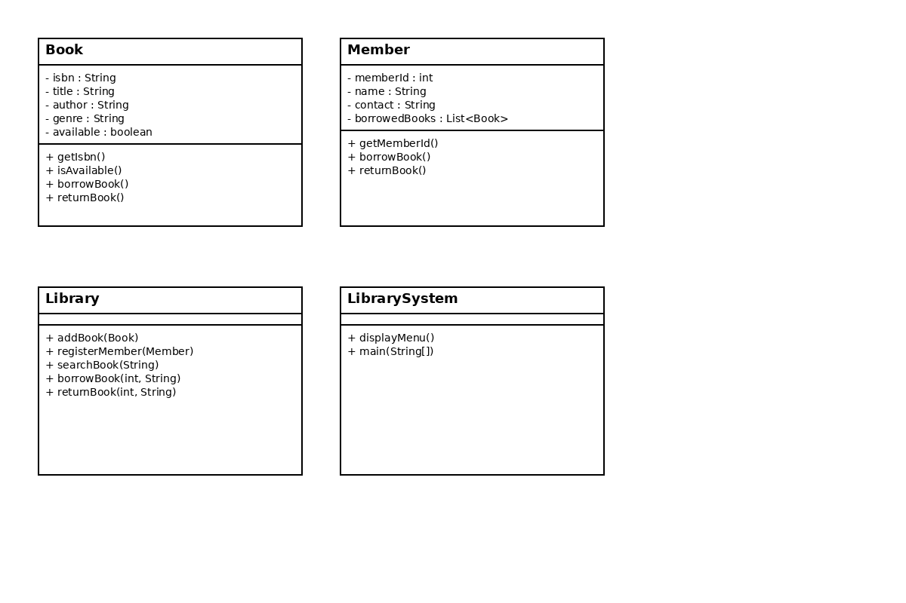

# Library Management System – Project Documentation

---

## 1. Project Overview
The Library Management System is a console-based Java application designed to manage books and library members efficiently.  
The system allows librarians to add and manage books, register members, search books, and perform borrowing and returning operations through a menu-driven interface.

This project is developed as part of the **Week 3 Internship Task** to demonstrate understanding of Object-Oriented Programming (OOP) concepts such as classes, objects, encapsulation, and class relationships.

---

## 2. Project Objectives
- To understand and apply Object-Oriented Programming concepts  
- To implement classes and objects in Java  
- To use encapsulation and data hiding  
- To manage books and members using separate classes  
- To implement borrowing and returning functionality  
- To build a structured, menu-driven console application  
- To validate book availability during operations  

---

## 3. Technologies Used
- Java (JDK 8 or above)  
- Spring Tool Suite (STS)  
- GitHub  
- GitHub Desktop  
- Scanner class for user input  

---

## 4. System Requirements

### Hardware Requirements
- Minimum 4 GB RAM  
- Any standard desktop or laptop  

### Software Requirements
- Windows Operating System  
- Java JDK 8 or above  
- Spring Tool Suite (STS)  
- GitHub / GitHub Desktop  

---

## 5. Setup and Project Installation Instructions
1. Install Java JDK (8 or above)  
2. Install Spring Tool Suite (STS)  
3. Clone or download the project from GitHub  
4. Open STS → File → Import → Existing Projects into Workspace  
5. Select the project folder and click **Finish**  
6. Navigate to `LibrarySystem.java`  
7. Right-click → **Run As → Java Application**  
8. Follow the menu instructions displayed in the console  

---

## 6.Class Diagram

The following UML class diagram represents the structure of the Library Management System and the relationships between Book, Member, Library, and LibrarySystem classes.

## 7. Project Structure

Library-Management-System/
│
├── src/
│   ├── Book.java
│   ├── Member.java
│   ├── Library.java
│   └── LibrarySystem.java
│
├── docs/
│   ├── Documentation.md
│   └── ClassDiagram.png
│
└── sample_data/
    └── sample_books.txt

---

## 8. Code Structure Explanation

### Book.java
Defines the Book class with attributes such as ISBN, title, author, genre, and availability.  
All fields are private and accessed using getter and setter methods.

### Member.java
Defines the Member class with attributes like memberId, name, contact details, and borrowed books.  
Encapsulation is implemented using private variables.

### Library.java
Contains the core logic for managing books and members, including add, search, borrow, and return operations.

### LibrarySystem.java
Acts as the main class that provides a menu-driven interface and handles user interaction using the Scanner class.

---

## 9. User Manual

### Menu Options
1. Add Book  
2. View All Books  
3. Register Member  
4. Borrow Book  
5. Return Book  
6. Search Book  
7. Exit  

### How to Use
- Enter the menu number to select an option  
- Provide required inputs when prompted  
- Borrowing is allowed only if the book is available  
- Messages are displayed for successful or failed operations  

---

## 10. Data Validation
- Book availability is checked before borrowing  
- Invalid book or member IDs are handled with error messages  
- Duplicate borrowing of the same book is restricted  

---

## 11. Technical Details
- Encapsulation: All class variables are private with public getters and setters  
- Abstraction: Library operations are managed internally by the Library class  
- Modularity: Separate classes for Book, Member, and Library logic  
- Class Relationships: Library manages collections of Book and Member objects  

---

## 12. Explanation of How Technical Requirements Are Met
- Book and Member classes created with required attributes  
- Proper encapsulation implemented using access modifiers  
- Borrow and return functionality implemented  
- Search functionality implemented by title and author  
- Menu-driven interface implemented using Scanner  
- Validation applied for book availability  

---

## 13. Testing Evidence

| Test Case | Input | Expected Output |
|---------|-------|----------------|
| Add Book | Valid details | Book added successfully |
| Borrow Book | Available book | Book borrowed successfully |
| Borrow Book | Unavailable book | Error message displayed |
| Search Book | Valid title | Book details displayed |
| Return Book | Valid book | Book returned successfully |

---

## 14. Conclusion
The Library Management System successfully meets all Week 3 project requirements.  
It demonstrates effective use of Object-Oriented Programming concepts, class design, encapsulation, and menu-driven application development in Java.

---

## 15. Author
Akshada Shelke
